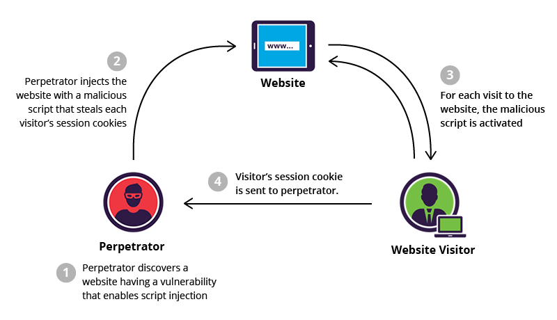

# 로그인 세션 관리하기

대부분의 서비스는 사용자가 로그인 한 후에, 서비스를 이용하는 동안 로그인을 다시할 필요가 없습니다. 한 서비스의 기능을 이용할 때마다 로그인을 다시해야 한다면 아무도 그 서비스를 이용하고 싶지 않겠죠...  
이렇게 특정 주기, 특정 상황에 로그인 상태를 유지하기 위한 개념들을 설명하고, 각각의 보안적인 문제, 해결법에 대해 설명해보겠습니다.

## 1. Cookie와 Session 

HTTP 프로토콜은 기본적으로 Connectionless와 Stateless 특징이 있습니다. 서버는 클라이언트와 통신이 끝나면 연결을 끊어버리고, 각 클라이언트에 대한 상태를 들고 있지 않습니다.  
> 헤더에 Connection: keep-alive 를 넣어 컨넥션을 유지하는 방법이 있긴합니다. HTTP/1.1 에서는 keep-alive가 Default 입니다.

이러한 특징을 Cookie를 통해 해결할 수 있습니다.  

Cookie의 특징과 사용법, 사용 예시에는 로그인세션 관리 이외에도 더 다양한 것이 있지만, 이 글에서는 로그인 세션관리와 관련된 부분만 다룹니다.

### i) Cookie

Cookie는 서버가 사용자의 웹 브라우저에 전송하는 **작은 데이터 조각**입니다.  
서버의 Response Header에 Set-Cookie로 이름과 값, 지속시간 등 쿠키에 저장할 데이터를 보내면 브라우저가 해당 값을 읽어 **사용자의 PC에 쿠키파일을 저장**합니다.  
그 이후 브라우저는 해당 도메인에 요청을 보낼 때 마다 Request Header에 해당 Cookie값을 넣어보내줍니다.

이러한 Cookie의 특성을 이용해서 사용자의 로그인 세션정보를 Set-Cookie로 사용자의 Cookie에 저장한 후 매 요청마다 로그인 세션 정보를 넘겨서 유지할 수 있게 합니다.  

  
출처: http://shiflett.org/articles/the-truth-about-sessions

하지만 로그인 관리를 위해 간단하게 Cookie를 사용하기에는 몇가지 단점이 있습니다.  

1. **Expires** 혹은 **Max-Age** 등을 명시하지 않으면 웹 브라우저의 **세션 복구** 기능으로 인해 **영속적인 값**이 됩니다.
2. 영속적이지 않다 해도 클라이언트가 로그인 세션을 관리하기 때문에, 서버 입장에서는 실제 사용자가 아니어도 로그인 세션값만 있다면 요청을 통과시킵니다.

위와 같은 문제를 해결할 수 있는 개념으로 **Session**이 있습니다.  

### ii) Session

Session은 Cookie를 기반으로 로그인 세션값을 관리하기에 적합한 규약입니다.  
가끔 Session과 Cookie를 아예 분리된 개념처럼 설명하는 글이 있는데 이는 잘못된 정보입니다. [MDN의 HTTP Cookie에 대한 설명](https://developer.mozilla.org/ko/docs/Web/HTTP/Cookies) 에서도 Session을 자주 언급하듯 Session은 Cookie와 분리해서 설명할 수 있는 개념이 아닙니다.  

Session은 Cookie를 기반으로 동작하되 몇가지 다른 특성을 가지고 있습니다.  

1. 로그인 세션값을 저장하고 관리하는 주체가 서버입니다.
2. 브라우저가 종료되면 해당 Session을 삭제합니다.
3. Session의 유지시간을 서버에서 관리할 수 있어 요청이 일정시간 없을 시 Session을 만료시킬 수 있다.

위 특징으로 기존에 로그인 세션값의 신뢰가 클라이언트이던 문제, 영속적이던 문제가 해결되었습니다.

> 로그인 세션값을 저장하고 관리하는 주체가 서버로 변경되었다고 해서 사용자의 쿠키저장 공간에 로그인 세션값이 저장되지 않는 것은 아닙니다. 단지 관리의 주체가 변경되었을 뿐입니다.

기존 Cookie의 몇가지 문제는 해결되었지만, 로그인 세션의 관리 주체가 서버로 변경되면서 자연스레 서버쪽에 메모리 부담이 생겼습니다. 동시 접속이 늘어날수록 서버는 Session유지 비용이 커지고, 늘어난 사용자를 대비해 WAS가 여러대가 되면 세션 클러스터링을 통해 세션을 유지 할 수 있어야 합니다.  
이런 부분은 Redis를 띄워 세션관리를 하거나, DB를 사용함으로 해결하는 등 다양한 방법이 있습니다.

하지만 여전히 XSS, CSRF 등 쿠키 보안의 취약점을 이용하여 요청을 위조하는 문제가 있고, 네트워크 패킷을 갈취하여 세션값을 얻어내는 문제에도 취약합니다. 이 문제와 해결책에 관해서는 **3.XSS와 CSRF**에서 자세하게 다룹니다.

## 2. LocalStorage와 SessionStorage

Cookie는 일반적인 클라이언트 측 스토리지로도 사용된 적이 있었습니다. Cookie가 클라이언트의 정보를 유일하게 저장하는 수단일 때는 적합했지만 요즘엔 modern storage APIs를 사용하는 것을 권장합니다.

> 클라이언트 스토리지를 위한 Modern APIs에는 LocalStorage와 Session Storage 등이 있습니다.

### i) LocalStorage

LocalStorage는 기존의 Cookie와 마찬가지로 클라이언트 측 스토리지 입니다. 도메인 단위로 저장공간이 있으며 Cookie와는 몇가지 차이점이 있는데

1. Cookie의 저장공간 4KB, LocalStorage의 저장공간 5MB 로 LocalStorage에 더 많은 클라이언트 데이터를 저장할 수 있습니다.
2. Cookie는 서버에서도 접근 가능하지만 LocalStorage는 오로지 클라이언트에서만 접근이 가능합니다.
3. LocalStorage는 기간설정이 불가하여 임의로 삭제하지 않으면 영구적으로 유지됩니다.

위 처럼 기존 Cookie와 비슷하지만 특히나 접근성 측면에서 서버에서 접근할 수가 없다는 점이 큰 차이점입니다.

### ii) SessionStorage

SessionStorage는 LocalStorage와 동일하게 동작하지만 차이점은 저장 위치와 삭제에 대한 조건입니다.  
LocalStorage는 사용자의 PC공간에 저장되는 반면 SessionStorage는 브라우저의 컨텍스트 영역에 저장됩니다. 이러한 특징으로 SessionStorage는 탭 단위로 유지되며 탭이 닫히면 SessionStorage의 데이터도 삭제됩니다.  

LocalStorage, SessionStorage 모두 클라이언트의 데이터를 저장하기에는 적합하지만 여전히 로그인 세션값을 관리하기엔 Cookie와 비슷한 단점들이 보입니다.  

지금까지 살펴본 4개의 개념들 중에는 Cookie의 Session을 사용하는게 가장 적합해 보입니다. 그럼 이제 각각의 방법으로 로그인 세션값을 다룰 때 흔하게 나오는 보안 이슈에 대해 얘기해보며 무엇으로 세션값을 관리해야 좋을 지 더 얘기해보겠습니다.

## 3. XSS, CSRF

Cookie와 Storage를 사용할 때 나오는 대표적인 보안 이슈로는 **XSS(사이트 간 스크립팅)** 와 **CSRF(크로스 사이트 요청 위조)** 가 있습니다.

### i) XSS(사이트 간 스크립팅)

XSS는 웹 페이지에 악성 스크립트를 삽입할 수 있는 취약점입니다. 
  
출처: https://www.incapsula.com/web-application-security/reflected-xss-attacks.html  

대표적인 예시로 [XSS 예문](https://ko.wikipedia.org/wiki/%EC%82%AC%EC%9D%B4%ED%8A%B8_%EA%B0%84_%EC%8A%A4%ED%81%AC%EB%A6%BD%ED%8C%85)을 참조하면 이해가 빠를 것입니다.

Cookie의 경우 HttpOnly 속성을 부여하면 javascript 를 통해 접근할 수가 없습니다. 그렇게 XSS 공격을 막을 수 있는 반면 LocalStorage, SessionStorage는 javascript로 접근을 막을 수 없습니다.  
LocalStorage, SessionStorage의 경우 XSS를 방지하는 방법은 html filtering 함수를 만들어 악성 스크립트를 방지하는 것 뿐입니다. 사실 이런 관점에서 로그인 세션값을 Storage에 저장하는 것은 보안에 좋지 않습니다.

### ii) CSRF(크로스 사이트 요청 위조)

CSRF는 특정 웹사이트의 브라우저를 신뢰하는 점을 이용한 공격 방법 입니다.  


출처: https://medium.com/@charithra/introduction-to-csrf-a329badfca49  

예시로 다음과 같은 공격용 html이 작성된 케이스입니다.

```html

```

공격자는 위와 같은 html이 있는 링크를 게시글로 공유합니다.  
이용자가 공격용 페이지를 열면, 브라우저는 이미지 파일을 받아오기 위해 공격용 URL을 엽니다. 만약 사용자의 쿠키가 유효하다면 해당 기능이 정상수행 됩니다.

CSRF를 방지하기 위해서는 XSS와 같은 html 필터를 두고 민감한 기능인 경우 확인 절차를 추가해야 합니다. 그리고 민감한 기능일 경우에 필요한 Cookie는 수명을 짧게 가져가는 것이 좋습니다.  
더욱 많은 예방 팁은 [OWASP CSRF 예방 치트 시트](https://www.owasp.org/index.php/Cross-Site_Request_Forgery_(CSRF)_Prevention_Cheat_Sheet)에 많이 나와있습니다.

지금까지 봤을 때 CSRF를 최대한 방지하고 XSS의 경우 Cookie의 Session을 사용하고 HttpOnly 속성을 부여하는 방향으로 가는게 가장 안전해 보입니다.  
사실 그래도 아직 문제가 있습니다. HTTP 통신의 경우 Cookie의 값이  서버와의 통신에 암호화 되지 않은 값으로 사용됩니다.  
패킷 분석, 패킷 가로채기를 이용하여 네트워크 통신에서의 패킷을 공격자가 읽을 수 있습니다. 만약 읽은 패킷의 데이터가 암호화 돼있지 않다면 결국 로그인 세션을 하이재킹 당하게 되겠죠. 이에 대한 해결책으로 **HTTPS 프로토콜**이 있습니다.

## 4. HTTP와 HTTPS

HTTPS는 [공개키 알고리즘](http://cryptocat.tistory.com/3)을 통해 암호화 하는 SSL 프로토콜을 사용하여 데이터를 주고받는 통신 규약입니다. 즉, HTTP와 HTTPS의 차이점을 간단히 말하면 **기존의 평문으로 보내던 패킷들을 암호화 하는 것**입니다.  

HTTP와 HTTPS에 대해서 알아야 할것이 너무 많아서 이 글에서는 정리하지 않겠습니다. 알아야 할 점은 HTTPS를 사용해 패킷을 암호화 하면 기존의 패킷 분석으로 로그인 세션값을 하이재킹 하는 부분을 막을 수 있다는 점입니다.  
HTTPS를 사용하면 보안이슈에서 많은 장점을 가져가지만 무작정 쓰진 않는 이유는 매 요청마다 https 암호화를 진행해야 하기 때문에 **기존보다 웹서버에 부하가 발생합니다.**

## 마무리

로그인 세션 관리를 할 때 쓰이는 몇가지 개념들과 취약점에 대해서 살펴 봤습니다. 약간 답정너의 느낌이 있지만 결국 보안을 가장 잘 지키려면 **Cookie의 Session을 사용하며 HTTPS로 통신하는 것**입니다. Session과 HTTPS 모두 웹서버에 부하를 줄 수 있으므로 이를 잘 관리하는 것도 중요할 것입니다.